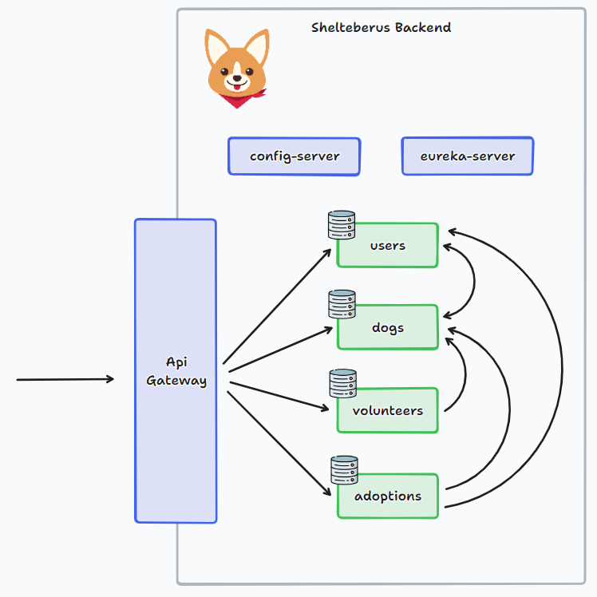

# Shelteberus: Spring Cloud Project with Prometheus/Grafana, ELK, Sonar & Jenkins

## Microservices
### Users
- Responsible for managing users
### Dogs
- Responsible for managing dogs
### Volunteers
- Responsible for managing volunteers
### Adoptions
- Responsible for managing adoptions

## Installation
1. ``maven clean install`` to install the project dependencies
2. ``docker-compose up --build`` to build up Prometheus, Grafana, ELK, Jenkins, Rabbitmq, Zipkin & PostgreSQL
3. Run the Sonarqube container: ``docker run -d --name sonarqube -e SONAR_ES_BOOTSTRAP_CHECKS_DISABLE=true -p 9000:9000 sonarqube:latest``
4. Start the Config Server from the IDE
5. Start the Eureka Server from the IDE
6. Start the Gateway Server from the IDE
7. Start the microservices (users, dogs, volunteers & adoptions) from the IDE

## Documentation
### Config Server
- Store the configurations for all microservices in the application
- Each microservice doesn't need to store its configuration

### Eureka server
- Service discovery for microservices
- Contains all the information about client microservices running on which IP address and port
- [Eureka URL](http://localhost:8761/)

### Gateway
- A simple, yet effective way to route to APIs
- Retrieve data from multiple services with a single request
- [Gateway URL](http://localhost:9000/)

### Zipkin
- Distributed tracing
- Provides mechanisms for sending, receiving, storing & visualizing traces
- [Zipkin URL](http://localhost:9411/)

### Users API
- Get users
- Get user by ID
- Create user
- Update user
- Delete user

### Dogs API
- Get dogs
- Get dog by ID
- Get reserved dogs of a user
- Get dogs associated to a volunteer
- Create dog
- Reserve a dog
- Cancel a reserve
- Delete a dog

### Volunteers API
- Get volunteers
- Get volunteer by ID
- Create volunteer
- Update volunteer
- Add dog to volunteer
- Delete dog from volunteer
- Delete volunteer

### Adoptions API
- Get adoptions
- Get adoption by ID
- Get adoption by user ID
- Create adoption
